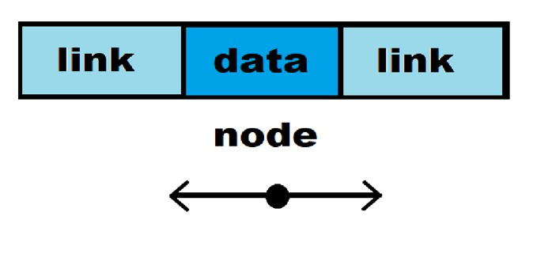
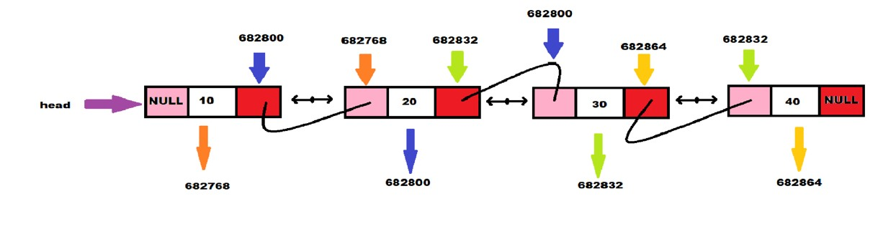

### Doubly Linked List (DLL)

A doubly linked list is a data structure where each element is referred to as a **node**. Each node contains three parts:

1. **Data**: This stores the value of the node.
2. **Next Link (`nlink`)**: This pointer points to the next node in the list.
3. **Previous Link (`plink`)**: This pointer points to the previous node in the list.

### Key Characteristics

- The **head pointer** points to the first node in the list.
- The `plink` of the first node is set to `NULL`, indicating there is no previous node.
- The `nlink` of the last node is set to `NULL`, indicating there is no subsequent node.

## Double Linked List:


### Node Structure Definition

The structure of a node in a doubly linked list is defined as follows:

```c
typedef struct dll {
    int data;             // Value of the node
    struct dll *nlink;   // Pointer to the next node
    struct dll *plink;   // Pointer to the previous node
} node;
```

## Doubly Linked List :
code:
```c
#include <stdio.h>
#include <stdlib.h>

typedef struct dll {
    int data;
    struct dll *nlink;
    struct dll *plink;
} node;

node *head = NULL;

node *memalloc(int d) {
    node *new = (node *)malloc(sizeof(node));
    if (new == NULL) {
        printf("Memory not allocated");
        exit(1);
    }
    new->data = d;
    new->nlink = NULL;
    new->plink = NULL;
    return new;
}

void insertAtFront(int d) {
    node *new = memalloc(d);
    if (head == NULL) {
        head = new;
        return;
    }
    new->nlink = head;
    head->plink = new;
    head = new;
}

void insertAtEnd(int d) {
    node *new = memalloc(d);
    if (head == NULL) {
        head = new;
        return;
    }
    node *temp = head;
    while (temp->nlink != NULL) {
        temp = temp->nlink;
    }
    temp->nlink = new;
    new->plink = temp;
}

int countNodes() {
    int count = 0;
    node *temp = head;
    while (temp != NULL) {
        temp = temp->nlink;
        count++;
    }
    printf("The number of list elements is: %d\n", count);
    return count;
}

void insertAtPosition() {
    int d, pos, c;
    c = countNodes();
    if (head == NULL) {
        printf("Your list is empty\n");
        printf("Enter your first node\n");
        printf("Enter the data element: ");
        scanf("%d", &d);
        insertAtFront(d);
        return;
    }
    printf("Enter the position: ");
    scanf("%d", &pos);
    if (pos < 0 || pos > c) {
        printf("Enter a valid position\n");
        return;
    }
    printf("Enter the list data: ");
    scanf("%d", &d);
    if (pos == 0) {
        insertAtFront(d);
        return;
    }
    if (pos == c) {
        insertAtEnd(d);
        return;
    }
    node *new = memalloc(d);
    node *temp = head;
    for (int i = 1; i < pos; i++) {
        temp = temp->nlink;
    }
    new->nlink = temp->nlink;
    new->plink = temp;
    if (temp->nlink != NULL) {
        temp->nlink->plink = new;
    }
    temp->nlink = new;
}

void deleteFromFront() {
    if (head == NULL) {
        printf("Your linked list is empty\n");
        return;
    }
    node *temp = head;
    head = temp->nlink;
    if (head != NULL) {
        head->plink = NULL;
    }
    free(temp);
}

void deleteFromEnd() {
    if (head == NULL) {
        printf("Your linked list is empty\n");
        return;
    }
    node *temp = head;
    while (temp->nlink != NULL) {
        temp = temp->nlink;
    }
    if (temp->plink != NULL) {
        temp->plink->nlink = NULL;
    } else {
        head = NULL; // List becomes empty
    }
    free(temp);
}

void display() {
    if (head == NULL) {
        printf("Your linked list is empty\n");
        return;
    }
    node *temp = head;
    printf("The data elements are: ");
    while (temp != NULL) {
        printf("%d ", temp->data);
        temp = temp->nlink;
    }
    printf("\n");
}

int main() {
    int option, data;

    while (1) {
        printf("1. Insert at Front\n");
        printf("2. Insert at End\n");
        printf("3. Insert at Position\n");
        printf("4. Delete from Front\n");
        printf("5. Delete from End\n");
        printf("6. Display List\n");
        printf("7. Count Nodes\n");
        printf("8. Exit\n");
        printf("Enter your option: ");
        scanf("%d", &option);

        switch (option) {
            case 1:
                printf("Enter the value: ");
                scanf("%d", &data);
                insertAtFront(data);
                break;
            case 2:
                printf("Enter the value: ");
                scanf("%d", &data);
                insertAtEnd(data);
                break;
            case 3:
                insertAtPosition();
                break;
            case 4:
                deleteFromFront();
                break;
            case 5:
                deleteFromEnd();
                break;
            case 6:
                display();
                break;
            case 7:
                countNodes();
                break;
            case 8:
                exit(0);
            default:
                printf("Invalid option, please try again.\n");
        }
        printf("\n");
    }

    return 0;
}
```
