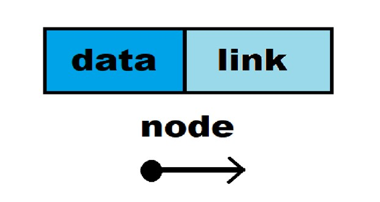
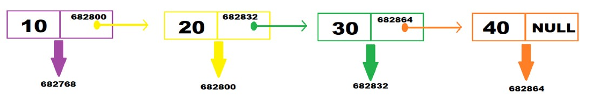

## **LINKED LIST**


**Linked List**  
A linear data structure consisting of nodes, each containing data and a reference (or link) to the next node.  

**Types of Linked Lists**
- **Singly Linked List (SLL):**  
  Each node contains data and a link to the next node.  
- **Doubly Linked List (DLL):**  
  Each node contains data, a link to the next node, and a link to the previous node.  
- **Circular Linked List (CLL):**  
  Similar to SLL or DLL, but the last node links back to the first node, creating a circular structure.  

**Singly Linked List (SLL)**
- Each element in a singly linked list is referred to as a node.
- Each node has two parts:  
  1. **Data:** Holds the value of the node.  
  2. **Link:** A pointer/reference to the next node in the list.
- A head pointer points to the first node of the list.
- The last node's link is NULL, indicating the end of the list.

## Singly Linked List : 


**Common Operations in SLL**
1. `insertfront`: Adds a new node at the beginning of the list.
2. `insertend`: Adds a new node at the end of the list.
3. `deletefront`: Removes the first node from the list.
4. `deleteend`: Removes the last node from the list.

**Using Structures in Linked Lists**
- Linked lists use self-referential structures to define nodes.
- A self-referential structure is a structure that contains a pointer to another structure of the same type.

**Example of a Self-Referential Structure**
```c
struct node {
    int data;
    struct node *link; // Self-referential structure
};
```

**Why Use a Structure?**
- Grouping of related data (data and link) into a single entity.
- Dynamic memory allocation: Nodes can be created and removed at runtime, making it easier to manage the linked list's size.
- Efficient memory usage: Only as much memory as needed is allocated.

---

**Linked List Implementation:**
```c
#include <stdio.h>
#include <stdlib.h>

// Define a structure 'node' to represent each node in the singly linked list
typedef struct s{
    int data;          // To store the integer data in the node
    struct s *link;    // Self-referencing pointer to the next node in the list
}node;

// Declare the head pointer and initialize it to NULL
node *head = NULL;

// Function to allocate memory for a new node and initialize it with a given value
node *memalloc(int d){
    node *new  = (node *) malloc(sizeof(node)); // Allocate memory for a new node
    if(new == NULL){                  // Check if memory allocation failed
        printf("Memory not allocated");
        exit(1);                      // Exit the program if memory allocation failed
    }
    new->data = d;        // Initialize the data field of the new node
    new->link = NULL;     // Initialize the link of the new node to NULL
    return new;           // Return the address of the newly created node
}

// Function to insert a new node at the beginning of the singly linked list
void insertfront(int d){
    node *new = memalloc(d);  // Call memalloc() to create a new node with data 'd'
    if(head == NULL){         // If the list is empty, make the new node the head node
        head = new;
        return;               // Exit the function as the insertion is complete
    }
    new->link = head;        // Link the new node to the current head node
    head = new;              // Update head to point to the new node, making it the new head
}

void insertend(int d){
    node *new = memalloc(d);  // Call memalloc() to create a new node with data 'd'
    node *temp = head;        // Use a temporary pointer to traverse the list starting from head
    if (head == NULL) {       // Check if the list is empty
        head = new;           // If empty, make the new node the head node
        return;               // Exit the function as the insertion is complete
    }
    while(temp->link != NULL){ // Traverse the list until the last node is reached
        temp = temp->link;     // Move to the next node
    }
    temp->link = new;          // Link the last node to the new node, adding it at the end of the list
}

// Function to print all elements in the singly linked list
void printlist(){
    printf("Your Elements are : ");
    node *temp = head;       // Use a temporary pointer to traverse the list starting from head
    while(temp !=NULL){      // Loop until the end of the list
        printf("%d ", temp->data);  // Print the data in the current node
        temp = temp->link;          // Move to the next node in the list
    }
    printf("\n");
}

int main(){
    insertfront(10);
    insertfront(20);
    insertfront(30);
    printlist();      // Print all elements in the list
    insertend(40);
    insertend(50);
    printlist();
}
```

